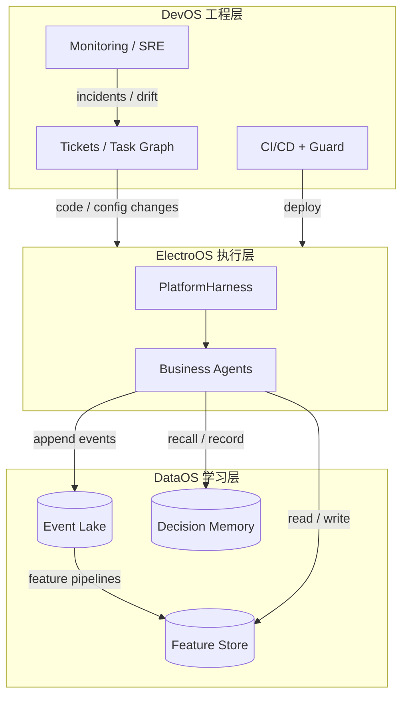
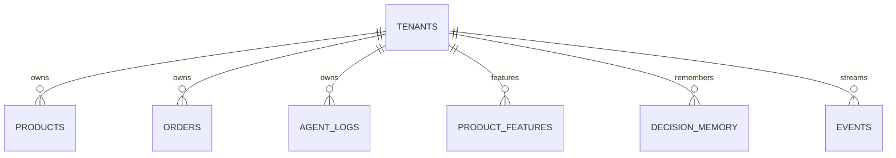

# ElectroOS + DataOS + DevOS：数据结构、系统结构与数据流

## What We're Building

在 Phase 1–4 叙事下，把 **ElectroOS（业务执行）**、**DataOS（学习与记忆）**、**DevOS（工程自治）** 的 **三层闭环** 固化成可沟通、可评审的 **系统结构 + 数据与存储分工 + Agent/事件数据流**。文中 SQL/DDL 为**落地导向的示意**，迁移与精确字段以 `/workflows:plan` 与 Drizzle schema 为准。

## Why This Approach

把「层—组件—存储—流」写清，可避免团队各自假设不同的租户边界与事件去向。YAGNI：**Event Lake 不一定第一天就上 ClickHouse**；可用 PostgreSQL 事件表或分区表顶住早期流量，再按阈值切 ClickHouse（与《架构》Open Questions 对齐）。

## 三层架构一览

| 层 | 职责 | 典型 Agents | 核心组件 |
|----|------|-------------|----------|
| **ElectroOS** | 多平台电商运营 | Product Scout、Price Sentinel、Support Relay、Ads Optimizer、Inventory Guard、Content Writer、Market Intel、Finance、CEO | PlatformHarness、Webhook/事件入口、预算与审批门控 |
| **DataOS** | 学习、特征、决策记忆 | Ingestion / Feature / Insight（命名可演进） | Event Lake、Feature Store、Decision Memory |
| **DevOS** | 维护、迭代、自治开发 | CTO、PM、Architect、前后端、DB、Harness、QA、Security、DevOps、SRE、Codebase Intel | Autonomous Dev Loop、CI/CD、Ticket/PR、监控告警、Constitution Guard |

**互联关系（概念）：** ElectroOS 产生事件 → DataOS 沉淀；Feature/Decision 反哺 ElectroOS Agent；ElectroOS/DevOS 经 Ticket 联动；战略类 Agent（CEO/Finance）驱动新任务循环。

## 存储与数据对象（WHAT）

### 1. 多租户基座（PostgreSQL + RLS）

- `tenants`；业务核心表统一 `tenant_id`。  
- 请求上下文注入 `app.tenant_id`（或等价会话变量），**RLS 策略**按租户过滤。  
- 落地时需对齐 **Paperclip `company` 与 `tenant` 映射**（见《架构》Open Questions）。

### 2. ElectroOS 域表（示意）

| 域 | 表/对象 | 要点 |
|----|---------|------|
| 商品 | `products` | `product_id`、名称、类目、`attributes` JSONB、价格、库存等 |
| 订单 | `orders` | `tenant_id`、`platform`、`items` JSONB、`status` |
| 审计 | `agent_logs` | `agent_id`、`action`、`payload`、时间戳 |
| 凭证 | `platform_credentials` | 按租户+平台；**令牌加密**；过期时间 |

服务间**禁止跨库读**；跨域经 API 或事件（见《宪法》）。

### 3. DataOS 三件套

| 组件 | 技术选项（目标态） | 用途 |
|------|-------------------|------|
| **Event Lake** | ClickHouse（示意 DDL 见下） | 高频、不可变事件历史、审计、分析、特征抽取输入 |
| **Feature Store** | Redis（短 TTL）+ PostgreSQL | 决策用特征快照；示例 `product_features` |
| **Decision Memory** | PostgreSQL + pgvector | 情境向量、`context`/`action`/`outcome`、相似检索 |

**语义统一（DataOS 核心）：** 多平台 × 多市场商品认知依赖 **Ontology + Market + Platform 三层** 与归一化商品表；详见 [`2026-03-21-electroos-global-product-ontology-brainstorm.md`](./2026-03-21-electroos-global-product-ontology-brainstorm.md)。

**分期说明：** MVP 可 **PostgreSQL 承载事件追加**；量与查询压上来再引入 ClickHouse，避免空转运维。

### 示意 DDL（节选，非最终迁移）

多租户与 RLS、ElectroOS 表与 DataOS 三表结构与用户提供的 Phase 文档一致；实施时统一纳入 `packages/db` 或等价模块。

## Agent 调度与数据流（文字）

1. **ElectroOS Agent：** 读 Feature Store / Decision Memory → 经 **PlatformHarness** 执行外部动作 → 写 **Event**（及日志）→ 异步刷新特征 / 写入决策与 outcome。  
2. **DevOS Loop：** Ticket → 规格与设计 → Task Graph → 实现 → QA/安全 → **人工审批（生产）** → 部署 → 监控产生新 Ticket。  
3. **跨层：** DataOS 为 ElectroOS 提供「记忆与特征」；DevOS 变更 ElectroOS/Harness 后，行为变化仍须满足宪法与 Guard。

## 数据流图（Mermaid）

> 下文即对「是否画图」的回应：**已用 Mermaid 表达**，可在支持 Mermaid 的编辑器或 CI 文档站中渲染。

**简化表关系（概念）：**

## Approaches Considered

| 方案 | 说明 | Pros | Cons | 适用 |
|------|------|------|------|------|
| **A. PG 事件表先行** | 早期 Event Lake 用 PG 分区/只追加 | 运维简单、与 Drizzle 一体 | 极大量时迁移 CH | **MVP / Phase 1–2** |
| **B. 自研起即 CH** | 事件直连 ClickHouse | 分析能力强 | 栈与成本高 | 高事件量团队 |
| **C. 托管分析** | 事件进仓 + 外包 BI | 省自建 | 延迟与合规需评估 | 后期 |

**Recommendation：** **A → B**，阈值由事件量、查询 SLA、成本触发（与架构文档 Open Question #4 一致）。

## Key Decisions

- 三层闭环：**执行（ElectroOS）— 学习（DataOS）— 工程（DevOS）** 职责与数据去向固定。  
- **Harness** 为外部唯一通道；**租户**为数据隔离单元（RLS + API）。  
- **事件全量**进 Lake（或 PG 等价物），支撑审计与 DataOS。  
- **ClickHouse / pgvector** 作为目标态能力，**允许分期**，避免过早堆栈。

## Open Questions

1. **Paperclip 域模型：** `tenant` 与 `company` 是否合一或映射？（继承《架构》Q1）  
2. **Event Lake 首发形态：** 确认 **PG 追加表** 作为 Phase 1 默认是否接受？  
3. **向量维度与模型：** `vector(1536)` 是否与所选 embedding 模型锁定？  
4. **战略 Agent（CEO/Finance）** 与 Ticket 的权限边界：是否只能创建「目标/预算」类任务，不能直接触发生产变更？

## Resolved Questions

- **是否需要单独「画图」？** → 已在本文件提供 **Mermaid** 数据流与概念 ER；若需 PNG/SVG，可在文档站或导出流水线中渲染。

## Next Steps

→ `/workflows:plan`：将示意表拆为 **Drizzle schema 模块顺序**、事件管道分期、与 Paperclip 租户上下文对齐方案。
