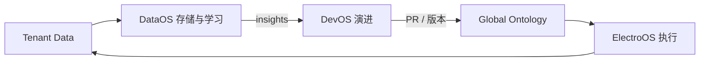

# 全球语义层：Global Brain + Tenant Memory（护城河底座）

## What We're Building

明确 **三层商品语义模型** 的**所有权与演进边界**：**不是**「全租户一套死共享」，**也不是**「每租户一套孤立 ontology」；而是 **Global Knowledge（系统资产）+ Tenant Adaptation（差异化与记忆）**，通过 **`tenant_id` 可空（NULL = 系统默认）** 在同一套表上实现 **Override（租户优先于系统默认）**。

同时固定分工：**DataOS** = 存储 + 学习与聚合演化；**ElectroOS** = 使用语义做决策与赚钱动作；**DevOS** = 发现缺口、生成/优化 mapping 与 ontology 变更（经 PR/Guard）。**Phase 1 必须落「骨架版」**（concepts + 少量 keyword），不能推迟到「DataOS Phase 3」才建，否则后续 Agent 与特征全量返工。

## Why This Approach

- **全共享：** 无法差异化，失去商业壁垒。  
- **全隔离：** 冷启动与跨租户学习失败，数据浪费。  
- **Global + Override：** 冷启动靠系统默认，增长靠租户增强；聚合后可反哺 Global（见下）。

## 架构结论（工程级）

| 问题 | 结论 |
|------|------|
| L1–L3 是否全租户共享？ | **否**；**L1 `concepts` 全局无 `tenant_id`**；**L2/L3 用可空 `tenant_id` 表达系统默认与租户覆盖** |
| 放哪？ | **DataOS** 存与进化；ElectroOS 读与执行；DevOS 演进资产 |
| 何时开始？ | **Phase 1 骨架**（如 20–100 concepts + 单市场 keyword），与 ElectroOS 同步 |

## 表级设计原则（WHAT）

| 资产类型 | 表 | `tenant_id` | 说明 |
|----------|-----|-------------|------|
| 世界模型 | `concepts` | **无**（全局） | DevOS 维护版本与演进 |
| 市场词 | `concept_keywords` | **NULLABLE** | `NULL` = 全租户默认；非空 = 租户定制 |
| 平台映射 | `platform_mappings` | **NULLABLE** | 共享类目映射 vs 租户标题策略/品牌模板覆盖 |
| 租户绩效与记忆 | `keyword_performance`、`decision_memory` 等 | **必填** | 仅租户私有 |

**`products_normalized`：** 始终带 `tenant_id`（租户视角下的归一化结果）。

## Override 解析规则（概念）

对同一 `concept_id` + `market`（+ 可选 `platform`）：

> **有效配置 = 租户行优先，否则回退系统默认行**（`tenant_id IS NULL`）。

示意逻辑（非最终实现）：查询时限定 `(tenant_id = $tenant OR tenant_id IS NULL)`，**解析层选「最具体」**：有租户专用则用租户，否则默认。**禁止**在业务代码里硬编码「只读 global」。

## 跨租户学习与 DevOS

- **DataOS：** 从租户行为与 `keyword_performance` 等聚合 **洞察**（哪些词赚钱、哪些市场有效）。  
- **DevOS：** 将洞察转为 **可审计变更**（新 concept、补 keyword、修 mapping），走 **PR + Constitution Guard**，再提升 Global 默认。  
- **终局叙事：** Ontology **不全是手写**，而是 **被租户数据喂养、由 DevOS 演进** — 仍须治理与版本化。

## 终局循环（文本）

```text
Tenant 数据 → DataOS 学习/聚合 → Global Ontology 优化候选
     ↑                                              ↓
ElectroOS 执行 ←────────────────────────────── DevOS 落地变更
```



## Phase 与能力对齐

| Phase | Global + Tenant | 说明 |
|-------|-----------------|------|
| **1** | `concepts` + `concept_keywords`（如仅 US）+ 可空 `tenant_id`  schema 就绪 | 不做 embedding / 自动学习 |
| **2** | 多市场词 + platform mapping + 覆盖行 | |
| **3** | `keyword_performance`、Feature Store、Decision Memory 接入 | DataOS 全量能力 |
| **4** | keyword / ontology **自进化**（仍经治理） | |

## Approaches Considered

| 方案 | Pros | Cons |
|------|------|------|
| **A. Global + NULLABLE tenant 覆盖**（推荐） | 单 schema、统一查询、可渐进增强 | 解析与缓存要严谨 |
| **B. 每租户 schema 复制** | 强隔离 | 迁移与统计地狱 |
| **C. 仅 global，无租户行** | 极简 | 无差异化，违背商业目标 |

## Key Decisions

- **护城河底座** = Global Brain + Tenant Memory，同一数据模型用 **可空租户** 表达。  
- **DataOS 拥有**语义资产存储与学习；**ElectroOS 消费**；**DevOS 演进** Global 资产（非直接手改生产）。  
- **Phase 1 必须**有 ontology 骨架，与「等 DataOS 第三期再做」互斥。

## Open Questions

1. **多行冲突：** 同一 concept/market 下租户多条 keyword 时，优先级规则（主词/实验桶/时间窗）？  
2. **回灌 Global：** 租户优化何时 **promote** 为系统默认（审批人、A/B 证据门槛）？  
3. **RLS：** `concept_keywords` / `platform_mappings` 是否对「`tenant_id` IS NULL」行仅 **服务角色可读**，租户 API 只读自身 + global 视图？

## Resolved Questions

- **三层是否「全租户共享」？** → **否**；**Global + 租户覆盖**，见上文。  
- **三层放哪？** → **DataOS 存与学**；使用在 ElectroOS；进化在 DevOS。

## Next Steps

→ `/workflows:plan`：DDL 含 **`tenant_id NULLABLE`**、解析服务接口、Phase 1 种子数据与 **Override 验收用例**（系统默认 vs 租户覆盖）。
